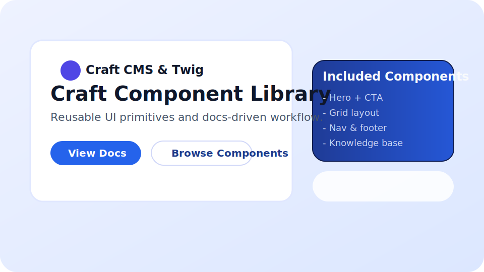

# Craft Component Library & Knowledge Base

Reusable Craft CMS + Twig project that ships a marketing-style landing page, a documentation hub, and a fully modeled knowledge base / FAQ workflow. Editors manage entries inside Craft, while the front-end uses reusable partials (`templates/_components`) so every page stays consistent.




## Highlights
- Component-driven Twig partials (nav, buttons, cards, grids, hero, search, article cards, FAQ accordion, pagination).
- Knowledge Base + FAQ sections with tags, related articles, pagination, and shared search component.
- Custom module (`modules/knowledgebase`) that scaffolds sections, fields, globals, and demo entries via `php craft kb/install`.
- Living documentation page (`templates/docs.twig`) that explains every component’s props + usage snippets.
- Accessible defaults, semantic HTML, and light/dark panels for contrast.

## Project Structure
```
craft-component-library/
├── templates/             # Page templates + shared Twig partials
│   ├── _components/       # Buttons, cards, nav, hero, footer, FAQ accordion, etc.
│   ├── kb/                # Knowledge base listing + detail templates
│   ├── faq/               # FAQ listing + entry view
│   └── _layouts/          # Base layout shell + global styles
├── modules/knowledgebase/ # CLI installer for sections, fields, globals, demo data
├── config/                # Craft config (project YAML, environments)
├── web/                   # Public web root (index.php, assets)
├── composer.json          # Craft CMS + plugin dependencies
└── README.md
```

## Getting Started
1. **Install dependencies**
   ```bash
   composer install
   ```
2. **Copy environment config**
   ```bash
   cp .env.example.dev .env
   # update DB credentials + PRIMARY_SITE_URL
   ```
3. **Install Craft** (if DB is empty)
   ```bash
   php craft install/check || php craft install/craft
   ```
4. **Seed demo content**
   ```bash
   php craft kb/install
   ```
5. **Run local server**
   ```bash
   php craft serve localhost:8080 --docroot=web
   ```
6. Visit `http://localhost:8080` for the landing/docs pages, `/kb` for the knowledge base, and `/faq` for categorized FAQs.

## Content Modeling
- **Knowledge Base** channel: summary, body, tag multi-select, related entries.
- **FAQ Categories** structure + **FAQ** channel related via entries field.
- **Global Site Chrome** (nav/footer links) managed via global set fields.

## Deployment Notes
- Keep `.env`, `storage/`, and `web/cpresources/` out of version control (see `.gitignore`).
- Configure a production database and run `php craft migrate/up` + `php craft project-config/apply` during deploys.
- For static hosting (e.g., Vite front-end), wire Craft templates to front-end build or expose JSON via GraphQL/Element API.

## Screenshots
| Landing | KB listing | FAQ |
| --- | --- | --- |
|  |  |  |

---
Built for showcasing Enterprise-style Craft CMS workflows with reusable Twig components and documented UX patterns.
