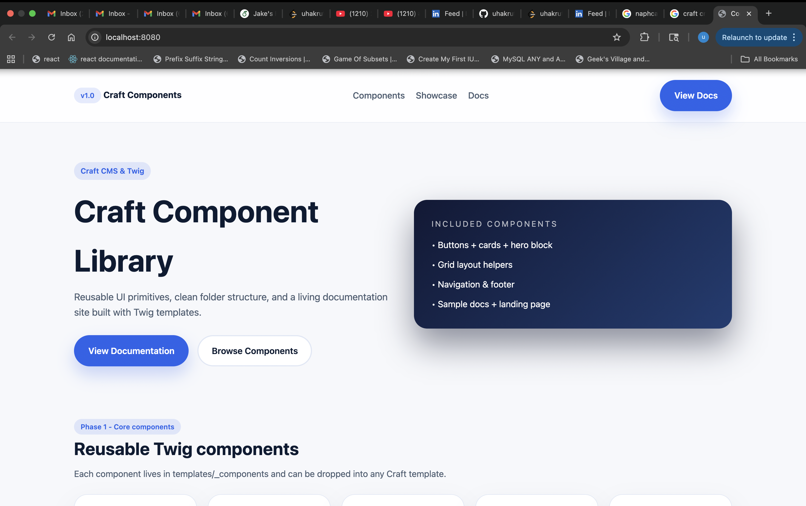
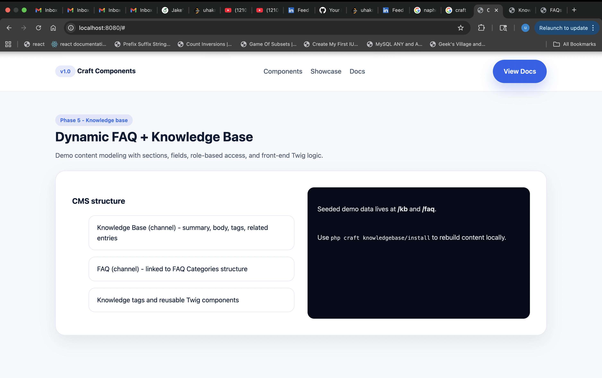
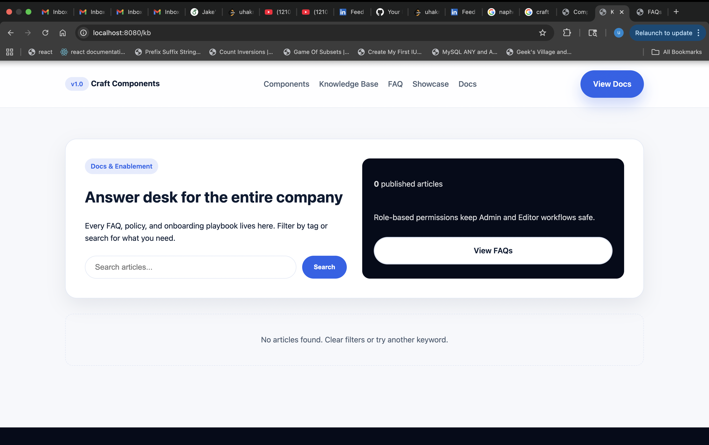

# Craft Component Library & Knowledge Base

Reusable Craft CMS + Twig project that ships a marketing-style landing page, a documentation hub, and a fully modeled knowledge base / FAQ workflow. Editors manage entries inside Craft, while the front-end uses reusable partials (`templates/_components`) so every page stays consistent.

## Highlights
- Component-driven Twig partials (nav, buttons, cards, grids, hero, search, article cards, FAQ accordion, pagination).
- Knowledge Base + FAQ sections with tags, related articles, pagination, and shared search component.
- Custom module (`modules/knowledgebase`) that scaffolds sections, fields, globals, and demo entries via `php craft kb/install`.
- Living documentation page (`templates/docs.twig`) that explains every component’s props + usage snippets.
- Accessible defaults, semantic HTML, and light/dark panels for contrast.

